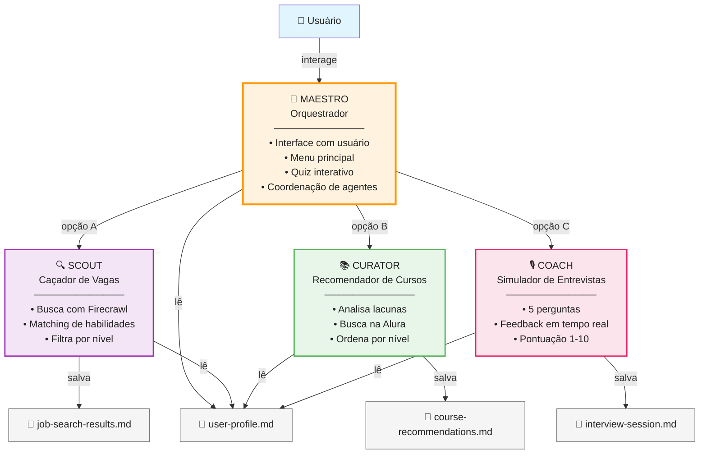

# 🎯 recoloca-ia

Um **sistema multi-agente conversacional** que auxilia usuários em sua jornada de desenvolvimento de carreira, combinando busca de empregos, identificação de lacunas de habilidades, recomendações de cursos personalizadas e simulação de entrevistas.

> **Desenvolvido durante a Imersão AluraIA** — Uma experiência prática com arquitetura de agentes especializados usando modelos Mixture of Experts (MoE).

---

## 📋 Visão Geral

Este projeto implementa uma **orquestração multi-agente** onde um agente principal (Maestro) coordena três agentes especializados (Scout, Curator, Coach) para criar uma experiência conversacional de desenvolvimento de carreira:

### 🎭 Os 4 Agentes

| Agente | Papel | Função |
|--------|-------|--------|
| **Maestro** | Orquestrador | Gerencia o fluxo da conversa, faz o quiz inicial, apresenta menus e coordena os sub-agentes |
| **Scout** | Caçador de Vagas | Busca vagas de emprego personalizadas com correspondência de habilidades |
| **Curator** | Especialista em Cursos | Recomenda cursos para preencher lacunas de habilidades identificadas |
| **Coach** | Simulador de Entrevistas | Realiza entrevistas simuladas com feedback e pontuação |

---

## 🏗️ Arquitetura



---

## 📚 Estrutura de Diretórios

```
recoloca-ia/
├── README.md                      # Este arquivo
├── AGENTS.md                      # Instruções de inicialização
├── PLANO-AULA-1.md               # Aula 1: Maestro e Quiz
├── PLANO-AULA-2.md               # Aula 2: Scout (Busca de Vagas)
├── PLANO-AULA-3.md               # Aula 3: Curator (Recomendação de Cursos)
├── PLANO-AULA-4.md               # Aula 4: Coach (Simulação de Entrevistas)
├── PROJECT_STRUCTURE.md           # Visão detalhada da estrutura
├── SCOUT_USAGE_GUIDE.md          # Guia de uso do Scout
├── SCOUT_QUICK_REFERENCE.md      # Referência rápida do Scout
├── SCOUT_TESTING_GUIDE.md        # Testes específicos do Scout
├── CHECKLIST_SCOUT.md            # Checklist de implementação do Scout
├── IMPLEMENTATION_SCOUT.md       # Detalhes de implementação do Scout
│
├── personas/                      # Especificações de cada agente
│   ├── maestro.md                 # Orquestrador principal
│   ├── scout.md                   # Caçador de vagas
│   ├── curator.md                 # Especialista em cursos
│   └── coach.md                   # Simulador de entrevistas
│
├── skills/                        # Capacidades especializadas
│   ├── dispatch.md                # Protocolo de handoff entre agentes
│   ├── firecrawl.md              # Integração com Firecrawl
│   ├── job-search.md             # Capacidades de busca de vagas
│   ├── course-analysis.md        # Análise e recomendação de cursos
│   └── interview-sim.md          # Simulação de entrevistas
│
└── data/                          # Armazenamento de estado (Markdown)
    ├── personality-quiz.md        # Respostas do quiz do usuário
    ├── user-profile.md            # Perfil consolidado
    ├── job-search-results.md      # Resultados da busca de vagas
    ├── course-recommendations.md  # Recomendações de cursos
    └── interview-session.md       # Rastreamento de entrevista
```

---

## 🎓 Planos de Aula

O projeto é estruturado em 4 aulas progressivas:

### 📖 **Aula 1: Maestro — Orquestrador** (`PLANO-AULA-1.md`)
- Criação do agente principal (Maestro)
- Quiz interativo de 7 perguntas
- Mapeamento de funções alvo
- Menu principal (A/B/C/D)
- Armazenamento de estado em Markdown

**Saiba mais**: Leia [`PLANO-AULA-1.md`](./PLANO-AULA-1.md)

### 🔍 **Aula 2: Scout — Agente de Busca de Vagas** (`PLANO-AULA-2.md`)
- Implementação do Scout
- Integração com Firecrawl para busca web
- Busca em Indeed, Catho, LinkedIn, Glassdoor, Infojobs
- Correspondência de habilidades com vagas
- Filtro por nível de experiência

**Saiba mais**: Leia [`PLANO-AULA-2.md`](./PLANO-AULA-2.md) e [`SCOUT_USAGE_GUIDE.md`](./SCOUT_USAGE_GUIDE.md)

### 📚 **Aula 3: Curator — Agente de Recomendação de Cursos** (`PLANO-AULA-3.md`)
- Implementação do Curator
- Busca de cursos na Alura
- Identificação de lacunas de habilidades
- Classificação por nível (iniciante/intermediário/avançado)
- Ordenação sugerida de aprendizado

**Saiba mais**: Leia [`PLANO-AULA-3.md`](./PLANO-AULA-3.md)

### 🎙️ **Aula 4: Coach — Simulador de Entrevistas** (`PLANO-AULA-4.md`)
- Implementação do Coach
- Entrevista simulada com 5 perguntas
- Perguntas comportamentais e técnicas
- Calibração por nível de experiência
- Feedback e pontuação (1-10)
- Despacho sequencial (6 ciclos)

**Saiba mais**: Leia [`PLANO-AULA-4.md`](./PLANO-AULA-4.md)

---

## 🚀 Fluxo de Uso

```
1. Usuário abre o agente
   ↓
2. Maestro saúda e faz o quiz (se necessário)
   ↓
3. Maestro apresenta o menu:
   
   A → Buscar Vagas (Scout)
       └─ Recebe lista de vagas com correspondência de habilidades
   
   B → Encontrar Cursos (Curator)
       └─ Recebe recomendações de cursos para preencher lacunas
   
   C → Praticar Entrevista (Coach)
       └─ Faz entrevista simulada com feedback
   
   D → Refazer Quiz
       └─ Recomeça o processo de perfil
   ↓
4. Retorna ao menu após cada ação
```

---

## 📋 Perguntas do Quiz

O Maestro coleta informações sobre o usuário através de 7 perguntas:

1. **Área de interesse** — Frontend, Backend, Ciência de Dados, Mobile, DevOps, Full Stack, Governança de Dados, Design UX/UI, Liderança, RH, Marketing, Growth Marketing, Gestão de Produtos, Cibersegurança
2. **Nível de experiência** — Júnior, Pleno, Sênior
3. **Preferência de trabalho** — Remoto, Híbrido, Presencial
4. **Localização** — Cidade/Estado ou Remoto
5. **Soft skills** — Comunicação, trabalho em equipe, liderança, etc.
6. **Objetivo de carreira** — Crescimento técnico, Transição, Primeiro emprego, Trilha de liderança
7. **Habilidades técnicas** — Lista de tecnologias que já domina

---

## 🔧 Tecnologias e Ferramentas

### Core
- **Arquitetura**: Sistema multi-agente com padrão orquestrador
- **Armazenamento**: Markdown (arquivos em `data/`)
- **Protocolo**: Envelope de despacho/resposta estruturado

### Integrações
- **Busca Web**: [Firecrawl](https://firecrawl.io/) — Scraping inteligente com IA
- **Fontes de Vagas**: Indeed, Catho, LinkedIn, Glassdoor, Infojobs
- **Cursos**: Alura (alura.com.br/formacoes)
- **Editor**: Zed (com spawn_agent para despacho de agentes)

### Modelos
- Optimizado para **Mixture of Experts (MoE)** — instruções claras, sem ambiguidades
- Sem tabelas Markdown — apenas listas numeradas com pares chave-valor
- Sem scripts gerados — personas implementadas através de comportamento conversacional

---

## 📁 Arquivos de Dados

Todo o estado do usuário é armazenado em `data/` como Markdown:

| Arquivo | Conteúdo |
|---------|----------|
| `personality-quiz.md` | Respostas do quiz de 7 perguntas |
| `user-profile.md` | Perfil consolidado + funções alvo mapeadas |
| `job-search-results.md` | Últimas vagas encontradas com correspondência de habilidades |
| `course-recommendations.md` | Recomendações de cursos com nível e duração |
| `interview-session.md` | Histórico de perguntas/respostas e pontuação da entrevista |

---

## 🔄 Protocolo de Despacho

Cada agente é despachado usando um **envelope estruturado**:

### Envelope de Despacho
```
## DESPACHO: [AGENTE]
### referencia_persona
[Persona completa do agente]

### tarefa
[Descrição exata da tarefa]

### perfil_usuario
[Dados do usuário de user-profile.md]

### contexto
[Contexto específico da tarefa]

### saida_esperada
[Formato exato de resposta esperada]
```

### Envelope de Resposta
```
## RESPOSTA: [AGENTE]
### estado
[sucesso | erro]

### resumo
[Resumo legível para o usuário]

### dados
[Resultados em formato estruturado]

### erros
[Detalhes de erro, se houver]
```

---

## 📖 Guias Adicionais

- **`PROJECT_STRUCTURE.md`** — Análise detalhada da arquitetura
- **`SCOUT_USAGE_GUIDE.md`** — Como usar o Scout em detalhes
- **`SCOUT_QUICK_REFERENCE.md`** — Referência rápida de commands
- **`SCOUT_TESTING_GUIDE.md`** — Cenários e testes
- **`CHECKLIST_SCOUT.md`** — Checklist de implementação

---

## ⚙️ Princípios de Design

✅ **Sem Ambiguidades** — Cada passo especifica exatamente o que fazer  
✅ **Sem Tabelas** — Apenas listas estruturadas (key-value)  
✅ **Estado Persistente** — Tudo em Markdown, human-readable  
✅ **Sem Scripts Gerados** — Personas são comportamento, não código  
✅ **Tratamento de Erros** — Relatório claro no campo `erros`  
✅ **MoE-Friendly** — Otimizado para modelos Mixture of Experts  

---

## 🎯 Mapeamento de Funções Alvo

O sistema mapeia 45 combinações de **Área × Nível** para funções específicas:

- **Frontend Júnior**: Desenvolvedor Frontend, Desenvolvedor UI Júnior, Desenvolvedor Web
- **Backend Pleno**: Engenheiro Backend, Desenvolvedor API, Desenvolvedor Python/Java
- **Ciência de Dados Sênior**: Cientista de Dados Sênior, Arquiteto ML, Líder IA
- ... e mais 42 combinações

Veja [`PLANO-AULA-1.md`](./PLANO-AULA-1.md) para a lista completa.

---

## 📝 Como Começar

1. **Leia o `AGENTS.md`** — Instruções de inicialização
2. **Estude o `PLANO-AULA-1.md`** — Entenda a arquitetura básica
3. **Explore `personas/maestro.md`** — Veja como um agente é definido
4. **Consulte `skills/dispatch.md`** — Protocolo de comunicação entre agentes
5. **Acompanhe os PLANOs progressivamente** — Aulas 2, 3, 4

---

## 📌 Status de Implementação

- ✅ **Aula 1** — Maestro + Quiz completo
- ✅ **Aula 2** — Scout (busca de vagas)
- ✅ **Aula 3** — Curator (recomendação de cursos)
- ✅ **Aula 4** — Coach (simulação de entrevistas)

---

## 🤝 Contribuições

Este é um projeto educacional da Imersão AluraIA. As especificações seguem rigorosamente diretrizes para modelos MoE, tornando este um excelente referencial para:

- Arquitetura de sistemas multi-agente
- Padrões de orquestração conversacional
- Integração com ferramentas de scraping (Firecrawl)
- Armazenamento de estado em Markdown
- Design de personas para IA conversacional

---

## 📄 Licença

Veja [`LICENSE`](./LICENSE) para detalhes.

---

## 🔗 Referências

- [Firecrawl](https://firecrawl.io/) — Web scraping com IA
- [Alura](https://www.alura.com.br/) — Plataforma de cursos
- [Zed Editor](https://zed.dev/) — Editor de código com suporte a agentes

---

**Desenvolvido com ❤️ durante a Imersão AluraIA**
